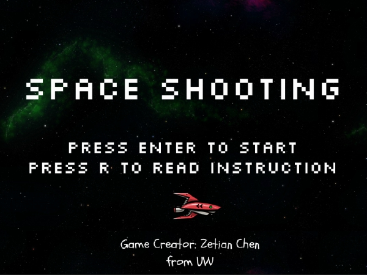
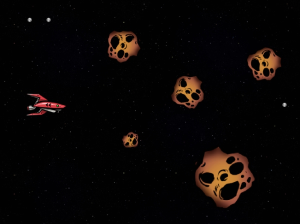

# Space Shooting

**Type**: Game

**Creator**: Zetian Chen

## Description

I always wanted to create games myself, and this is my first time to use an application called "Game Maker Studio" to create a complete game.

To understand how to use Game Maker Studio, I watched some tutorial videos on Youtube and read the documentation on the official website of GameMaker.

In this game, player can press keys "W" to move upward, "S" to move downward, "A" to move leftward and "D" to move rightward. Press space key to shoot bullets to destroy asteroids rolling over here and get points.

I'll learn more to create more complex games. Hope you enjoy this little game!

**Start Interface**

**Game Interface**

**Note**:

This repository contains the game application as well as all the resources to create the game. I found the images I used in this game on line. Particularly give credits to website [OpenGameArt](https://opengameart.org/) for its images and [FreeSoundEffects](https://www.freesoundeffects.com/) for its audios.
