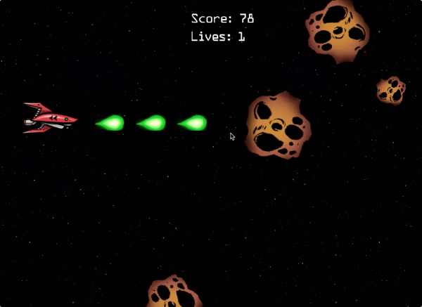
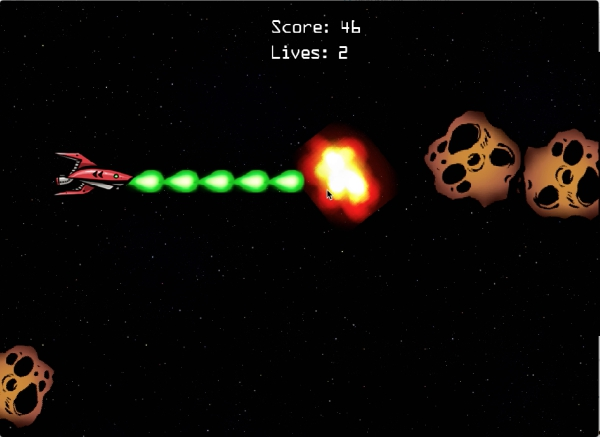

# Space Shooting

**Type**: Game

**Creator**: Zetian Chen

## Link To Demo Video On Youtube

[space shooting demo video](https://youtu.be/jBiB_SzYsVo)

## Demo Images

**Start Interface**

**Game Interface**

**Shooting Scene**

**Explosion Scene**

## Description

I always wanted to create games myself, and this is my first time to use an application called "Game Maker Studio" to create a complete game.

To understand how to use Game Maker Studio, I watched some tutorial videos on Youtube and read the documentation on the official website of GameMaker.

In this game, player can press keys "W" to move upward, "S" to move downward, "A" to move leftward and "D" to move rightward. Press space key to shoot bullets to destroy asteroids rolling over here and get points. The player (the red spaceship) cannot move outside of the game area.

Asteroids are of different sizes. The bigger the asteroid is, the slower it moves, the higher its hp is. In other words, big asteroids are harder to destroy. However, they would move much slower than smaller asteroids. After an asteroid is destroyed, its hp will be converted into points and added to player's score.

I'll learn more to create more complex games. Hope you enjoy this little game!

## Installation

This game currently only runs on MacOS. Due to some reason, if the repo is downloaded using "download zip" option, the file may be corrupt. Therefore, it is suggested that you download using git. Below is the command to run in terminal:

`$ git clone https://github.com/neuricos/space_shooting.git`

## Special Note

This repository contains the game application as well as all the resources to create the game. I found the images I used in this game on line. Particularly give credits to website [OpenGameArt](https://opengameart.org/) for its images and [FreeSoundEffects](https://www.freesoundeffects.com/) for its audios.
